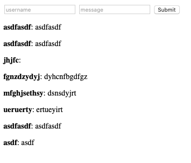
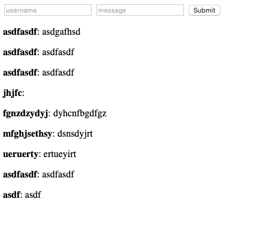

# Lab 09 Report - Leonid Lygin

## Configuration

### Replicaset installation

Using `helm` to deploy:

```
$ helm install --name mongodb-replicaset stable/mongodb-replicaset
```

Pods (age is big, this is done afterwards):

```
$ kubectl get pods
NAME                        READY   STATUS    RESTARTS   AGE
mongodb-replicaset-0        1/1     Running   0          77m
mongodb-replicaset-1        1/1     Running   0          76m
mongodb-replicaset-2        1/1     Running   0          75m
```

### Application packaging

```
$ docker build -t ionagamed/ds-lab-09:latest
$ docker push ionagamed/ds-lab-09:latest
$ helm init app
... manual editing of helm templates ...
$ helm install chat --set service.type=NodePort ./app
```

## Testing

### Last messages



### Output of replicaset status

`rs.status()`:

```json
{
	"set" : "rs0",
	"date" : ISODate("2019-10-30T07:14:21.493Z"),
	"myState" : 1,
	"term" : NumberLong(3),
	"syncingTo" : "",
	"syncSourceHost" : "",
	"syncSourceId" : -1,
	"heartbeatIntervalMillis" : NumberLong(2000),
	"optimes" : {
		"lastCommittedOpTime" : {
			"ts" : Timestamp(1572419661, 1),
			"t" : NumberLong(3)
		},
		"readConcernMajorityOpTime" : {
			"ts" : Timestamp(1572419661, 1),
			"t" : NumberLong(3)
		},
		"appliedOpTime" : {
			"ts" : Timestamp(1572419661, 1),
			"t" : NumberLong(3)
		},
		"durableOpTime" : {
			"ts" : Timestamp(1572419661, 1),
			"t" : NumberLong(3)
		}
	},
	"members" : [
		{
			"_id" : 0,
			"name" : "mongodb-replicaset-0.mongodb-replicaset.default.svc.cluster.local:27017",
			"health" : 1,
			"state" : 1,
			"stateStr" : "PRIMARY",
			"uptime" : 4468,
			"optime" : {
				"ts" : Timestamp(1572419661, 1),
				"t" : NumberLong(3)
			},
			"optimeDate" : ISODate("2019-10-30T07:14:21Z"),
			"syncingTo" : "",
			"syncSourceHost" : "",
			"syncSourceId" : -1,
			"infoMessage" : "",
			"electionTime" : Timestamp(1572415278, 1),
			"electionDate" : ISODate("2019-10-30T06:01:18Z"),
			"configVersion" : 3,
			"self" : true,
			"lastHeartbeatMessage" : ""
		},
		{
			"_id" : 1,
			"name" : "mongodb-replicaset-1.mongodb-replicaset.default.svc.cluster.local:27017",
			"health" : 1,
			"state" : 2,
			"stateStr" : "SECONDARY",
			"uptime" : 4392,
			"optime" : {
				"ts" : Timestamp(1572419651, 1),
				"t" : NumberLong(3)
			},
			"optimeDurable" : {
				"ts" : Timestamp(1572419651, 1),
				"t" : NumberLong(3)
			},
			"optimeDate" : ISODate("2019-10-30T07:14:11Z"),
			"optimeDurableDate" : ISODate("2019-10-30T07:14:11Z"),
			"lastHeartbeat" : ISODate("2019-10-30T07:14:20.134Z"),
			"lastHeartbeatRecv" : ISODate("2019-10-30T07:14:20.284Z"),
			"pingMs" : NumberLong(0),
			"lastHeartbeatMessage" : "",
			"syncingTo" : "mongodb-replicaset-0.mongodb-replicaset.default.svc.cluster.local:27017",
			"syncSourceHost" : "mongodb-replicaset-0.mongodb-replicaset.default.svc.cluster.local:27017",
			"syncSourceId" : 0,
			"infoMessage" : "",
			"configVersion" : 3
		},
		{
			"_id" : 2,
			"name" : "mongodb-replicaset-2.mongodb-replicaset.default.svc.cluster.local:27017",
			"health" : 1,
			"state" : 2,
			"stateStr" : "SECONDARY",
			"uptime" : 4319,
			"optime" : {
				"ts" : Timestamp(1572419651, 1),
				"t" : NumberLong(3)
			},
			"optimeDurable" : {
				"ts" : Timestamp(1572419651, 1),
				"t" : NumberLong(3)
			},
			"optimeDate" : ISODate("2019-10-30T07:14:11Z"),
			"optimeDurableDate" : ISODate("2019-10-30T07:14:11Z"),
			"lastHeartbeat" : ISODate("2019-10-30T07:14:20.141Z"),
			"lastHeartbeatRecv" : ISODate("2019-10-30T07:14:20.283Z"),
			"pingMs" : NumberLong(0),
			"lastHeartbeatMessage" : "",
			"syncingTo" : "mongodb-replicaset-1.mongodb-replicaset.default.svc.cluster.local:27017",
			"syncSourceHost" : "mongodb-replicaset-1.mongodb-replicaset.default.svc.cluster.local:27017",
			"syncSourceId" : 1,
			"infoMessage" : "",
			"configVersion" : 3
		}
	],
	"ok" : 1,
	"operationTime" : Timestamp(1572419661, 1),
	"$clusterTime" : {
		"clusterTime" : Timestamp(1572419661, 1),
		"signature" : {
			"hash" : BinData(0,"AAAAAAAAAAAAAAAAAAAAAAAAAAA="),
			"keyId" : NumberLong(0)
		}
	}
    }
```

`rs.config()`:

```json
{
	"_id" : "rs0",
	"version" : 3,
	"protocolVersion" : NumberLong(1),
	"members" : [
		{
			"_id" : 0,
			"host" : "mongodb-replicaset-0.mongodb-replicaset.default.svc.cluster.local:27017",
			"arbiterOnly" : false,
			"buildIndexes" : true,
			"hidden" : false,
			"priority" : 1,
			"tags" : {

			},
			"slaveDelay" : NumberLong(0),
			"votes" : 1
		},
		{
			"_id" : 1,
			"host" : "mongodb-replicaset-1.mongodb-replicaset.default.svc.cluster.local:27017",
			"arbiterOnly" : false,
			"buildIndexes" : true,
			"hidden" : false,
			"priority" : 1,
			"tags" : {

			},
			"slaveDelay" : NumberLong(0),
			"votes" : 1
		},
		{
			"_id" : 2,
			"host" : "mongodb-replicaset-2.mongodb-replicaset.default.svc.cluster.local:27017",
			"arbiterOnly" : false,
			"buildIndexes" : true,
			"hidden" : false,
			"priority" : 1,
			"tags" : {

			},
			"slaveDelay" : NumberLong(0),
			"votes" : 1
		}
	],
	"settings" : {
		"chainingAllowed" : true,
		"heartbeatIntervalMillis" : 2000,
		"heartbeatTimeoutSecs" : 10,
		"electionTimeoutMillis" : 10000,
		"catchUpTimeoutMillis" : -1,
		"catchUpTakeoverDelayMillis" : 30000,
		"getLastErrorModes" : {

		},
		"getLastErrorDefaults" : {
			"w" : 1,
			"wtimeout" : 0
		},
		"replicaSetId" : ObjectId("5db926c3113870d7b279b106")
	}
}
```


### Removing one node

```
$ kubectl delete pod mongodb-replicaset-0
```

Screenshot:



`rs.status()`:

```json
{
	"set" : "rs0",
	"date" : ISODate("2019-10-30T07:20:27.519Z"),
	"myState" : 1,
	"term" : NumberLong(4),
	"syncingTo" : "",
	"syncSourceHost" : "",
	"syncSourceId" : -1,
	"heartbeatIntervalMillis" : NumberLong(2000),
	"optimes" : {
		"lastCommittedOpTime" : {
			"ts" : Timestamp(1572420021, 1),
			"t" : NumberLong(4)
		},
		"readConcernMajorityOpTime" : {
			"ts" : Timestamp(1572420021, 1),
			"t" : NumberLong(4)
		},
		"appliedOpTime" : {
			"ts" : Timestamp(1572420021, 1),
			"t" : NumberLong(4)
		},
		"durableOpTime" : {
			"ts" : Timestamp(1572420021, 1),
			"t" : NumberLong(4)
		}
	},
	"members" : [
		{
			"_id" : 0,
			"name" : "mongodb-replicaset-0.mongodb-replicaset.default.svc.cluster.local:27017",
			"health" : 0,
			"state" : 8,
			"stateStr" : "(not reachable/healthy)",
			"uptime" : 0,
			"optime" : {
				"ts" : Timestamp(0, 0),
				"t" : NumberLong(-1)
			},
			"optimeDurable" : {
				"ts" : Timestamp(0, 0),
				"t" : NumberLong(-1)
			},
			"optimeDate" : ISODate("1970-01-01T00:00:00Z"),
			"optimeDurableDate" : ISODate("1970-01-01T00:00:00Z"),
			"lastHeartbeat" : ISODate("2019-10-30T07:20:25.724Z"),
			"lastHeartbeatRecv" : ISODate("2019-10-30T07:19:59.073Z"),
			"pingMs" : NumberLong(0),
			"lastHeartbeatMessage" : "Connection refused",
			"syncingTo" : "",
			"syncSourceHost" : "",
			"syncSourceId" : -1,
			"infoMessage" : "",
			"configVersion" : -1
		},
		{
			"_id" : 1,
			"name" : "mongodb-replicaset-1.mongodb-replicaset.default.svc.cluster.local:27017",
			"health" : 1,
			"state" : 1,
			"stateStr" : "PRIMARY",
			"uptime" : 4774,
			"optime" : {
				"ts" : Timestamp(1572420021, 1),
				"t" : NumberLong(4)
			},
			"optimeDate" : ISODate("2019-10-30T07:20:21Z"),
			"syncingTo" : "",
			"syncSourceHost" : "",
			"syncSourceId" : -1,
			"infoMessage" : "could not find member to sync from",
			"electionTime" : Timestamp(1572419969, 1),
			"electionDate" : ISODate("2019-10-30T07:19:29Z"),
			"configVersion" : 3,
			"self" : true,
			"lastHeartbeatMessage" : ""
		},
		{
			"_id" : 2,
			"name" : "mongodb-replicaset-2.mongodb-replicaset.default.svc.cluster.local:27017",
			"health" : 1,
			"state" : 2,
			"stateStr" : "SECONDARY",
			"uptime" : 4684,
			"optime" : {
				"ts" : Timestamp(1572420021, 1),
				"t" : NumberLong(4)
			},
			"optimeDurable" : {
				"ts" : Timestamp(1572420021, 1),
				"t" : NumberLong(4)
			},
			"optimeDate" : ISODate("2019-10-30T07:20:21Z"),
			"optimeDurableDate" : ISODate("2019-10-30T07:20:21Z"),
			"lastHeartbeat" : ISODate("2019-10-30T07:20:27.460Z"),
			"lastHeartbeatRecv" : ISODate("2019-10-30T07:20:26.323Z"),
			"pingMs" : NumberLong(0),
			"lastHeartbeatMessage" : "",
			"syncingTo" : "mongodb-replicaset-1.mongodb-replicaset.default.svc.cluster.local:27017",
			"syncSourceHost" : "mongodb-replicaset-1.mongodb-replicaset.default.svc.cluster.local:27017",
			"syncSourceId" : 1,
			"infoMessage" : "",
			"configVersion" : 3
		}
	],
	"ok" : 1,
	"operationTime" : Timestamp(1572420021, 1),
	"$clusterTime" : {
		"clusterTime" : Timestamp(1572420021, 1),
		"signature" : {
			"hash" : BinData(0,"AAAAAAAAAAAAAAAAAAAAAAAAAAA="),
			"keyId" : NumberLong(0)
		}
	}
}
```

`rs.config()`:

```json
{
	"_id" : "rs0",
	"version" : 3,
	"protocolVersion" : NumberLong(1),
	"members" : [
		{
			"_id" : 0,
			"host" : "mongodb-replicaset-0.mongodb-replicaset.default.svc.cluster.local:27017",
			"arbiterOnly" : false,
			"buildIndexes" : true,
			"hidden" : false,
			"priority" : 1,
			"tags" : {

			},
			"slaveDelay" : NumberLong(0),
			"votes" : 1
		},
		{
			"_id" : 1,
			"host" : "mongodb-replicaset-1.mongodb-replicaset.default.svc.cluster.local:27017",
			"arbiterOnly" : false,
			"buildIndexes" : true,
			"hidden" : false,
			"priority" : 1,
			"tags" : {

			},
			"slaveDelay" : NumberLong(0),
			"votes" : 1
		},
		{
			"_id" : 2,
			"host" : "mongodb-replicaset-2.mongodb-replicaset.default.svc.cluster.local:27017",
			"arbiterOnly" : false,
			"buildIndexes" : true,
			"hidden" : false,
			"priority" : 1,
			"tags" : {

			},
			"slaveDelay" : NumberLong(0),
			"votes" : 1
		}
	],
	"settings" : {
		"chainingAllowed" : true,
		"heartbeatIntervalMillis" : 2000,
		"heartbeatTimeoutSecs" : 10,
		"electionTimeoutMillis" : 10000,
		"catchUpTimeoutMillis" : -1,
		"catchUpTakeoverDelayMillis" : 30000,
		"getLastErrorModes" : {

		},
		"getLastErrorDefaults" : {
			"w" : 1,
			"wtimeout" : 0
		},
		"replicaSetId" : ObjectId("5db926c3113870d7b279b106")
	}
}
```
